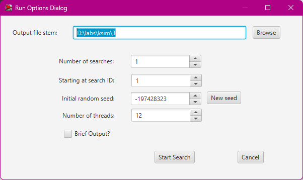

## Комп'ютерні системи для моделювання
## Група СПм-22-6, **Старов Олексій Євгенович**
### Лабораторна робота №3. Застосування обчислювального інтелекту для оптимізації імітаційних моделей

### Обраний варіант (№8): модель у середовищі NetLogo:
[Segregation Simple Extension 1](http://www.netlogoweb.org/launch#http://www.netlogoweb.org/assets/modelslib/IABM%20Textbook/chapter%203/Segregation%20Extensions/Segregation%20Simple%20Extension%201.nlogo)

### Опис моделі:
Ця модель демонструє взаємодію "черепах" різних етнічних груп у симульованому середовищі. Незважаючи на загальну доброзичливість, кожна черепаха прагне оточити себе представниками своєї групи. Мета симуляції — проаналізувати, як індивідуальні переваги впливають на розподіл "черепах" і створення загальних шаблонів поведінки.

### Основні параметри моделі:
- **number**: кількість черепах у симуляції.
- **number-of-ethnicities**: кількість етнічних груп.
- **%-similar-wanted**: відсоток сусідів, які належать до однієї групи, якого прагнуть черепахи.

### Метрики:
- **percent similar**: середній відсоток сусідів однієї етнічної групи для кожної черепахи.
- **percent unhappy**: відсоток черепах, які незадоволені розподілом сусідів.

---

### Налаштування середовища BehaviorSearch:
#### Обрана модель:
Файл:  
```
D:\labs\Старов\Segregation Simple Extension 1.nlogo
```

#### Параметри моделі:
- Параметри та діапазони значень:
```
["number" [500 10 2500]]
["%-similar-wanted" [10 1 100]]
["number-of-ethnicities" [2 1 5]]
```

#### Використовувана метрика:
Для функції цільової (фітнес-функції) використовується значення **кількості вбивств**, що розраховується в кінці симуляції з нульового такту:
- Вказано у параметрі `Measure`: `count-kill`.
- Параметр `Mesure if`: `true`, тобто враховуються всі такти симуляції.

#### Параметри запуску:
- **Setup**: процедура ініціалізації.
- **Go**: процедура запуску.
- **Stop if**: не використовується.

#### Цільова функція:
Мета — **мінімізація значення фітнес-функції**:
- Goal: `Minimize Fitness`.
- Вибірка значень: `AT_FINAL_STEP`.
- Кожна симуляція повторюється **10 разів** для усереднення результатів.

---

### Налаштування пошукових алгоритмів:
1. **Генетичний алгоритм:**


2. **Випадковий пошук:**


---

### Результати:
#### Використання BehaviorSearch:
- Запуск пошуку:  


- **Генетичний алгоритм:**


- **Випадковий пошук:**

